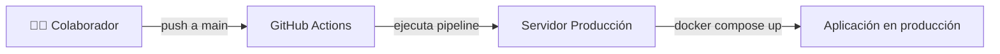

se# 🌐 WebConsulta

Aplicación web desarrollada con **Next.js** y estilizada con **TailwindCSS**.  
El despliegue en producción está totalmente automatizado mediante **Docker Compose** y una **pipeline de GitHub Actions**.

---

## 🚀 Características principales
- **Frontend en Next.js**: framework React moderno y optimizado.
- **Docker Compose**: un único comando para levantar el proyecto en local o en producción.
- **CI/CD Automatizado**: cada `git push` a la rama `main` activa una pipeline que actualiza la app en el servidor de producción en cuestión de segundos.
- **Espacio de discusiones**: abierto en GitHub Discussions para propuestas de mejora, soporte y debate sobre problemas.

---

## 🛠️ Levantar la aplicación en local para desarrollo

### 1. Clonar el repositorio
```bash
git clone git@github.com:raulgimenez/webconsulta.git
cd webconsulta
```

### 2. Instalar dependencias (modo desarrollo)
Si quieres trabajar directamente con Next.js sin Docker:
```bash
npm install
npm run dev
```
Esto abrirá la app en `http://localhost:3000`.

### 3. Usar Docker Compose (recomendado)
Si prefieres trabajar con el mismo entorno que en producción:
```bash
docker compose up --build
```

La app quedará accesible en:  
👉 [http://localhost:3000](http://localhost:3000)

Para detener los contenedores:
```bash
docker compose down
```

---

## 📦 Despliegue en producción

- La rama `main` está vinculada a una **pipeline de GitHub Actions**.
- Cuando haces `git push` a `main`:
  1. La pipeline conecta con el servidor de producción.
  2. Ejecuta `git fetch/reset` para actualizar el código.
  3. Corre `docker compose down && docker compose up -d --build`.
  4. En segundos, los cambios están en producción.

⚠️ **Importante**:  
No hagas commits directos en `main`.  
Lo recomendable es trabajar en ramas de feature/fix y abrir un **Pull Request**.

---

## 💬 Colaboración y soporte

- Hemos habilitado un espacio de **[GitHub Discussions](../../discussions)** para:
  - Reportar problemas.
  - Proponer mejoras.
  - Resolver dudas técnicas.
  - Debatir sobre el roadmap del proyecto.

### Normas básicas
- Usa títulos claros y descripciones detalladas.
- Para errores, especifica pasos para reproducir.
- Para ideas, explica el valor añadido.

---

## 👥 Cómo colaborar

1. Haz un **fork** del repo.
2. Crea una rama de feature:
   ```bash
   git checkout -b feature/nueva-funcionalidad
   ```
3. Haz commit y push a tu fork.
4. Abre un **Pull Request** hacia `main`.

---

## ⚙️ Requisitos previos

- Node.js >= 18
- Docker y Docker Compose (para entorno idéntico a producción)
- Git

---

## 🔄 Flujo de despliegue (CI/CD)



---

## 📜 Licencia

Este proyecto se distribuye bajo la licencia MIT.  
Consulta el archivo [LICENSE](LICENSE) para más información.
